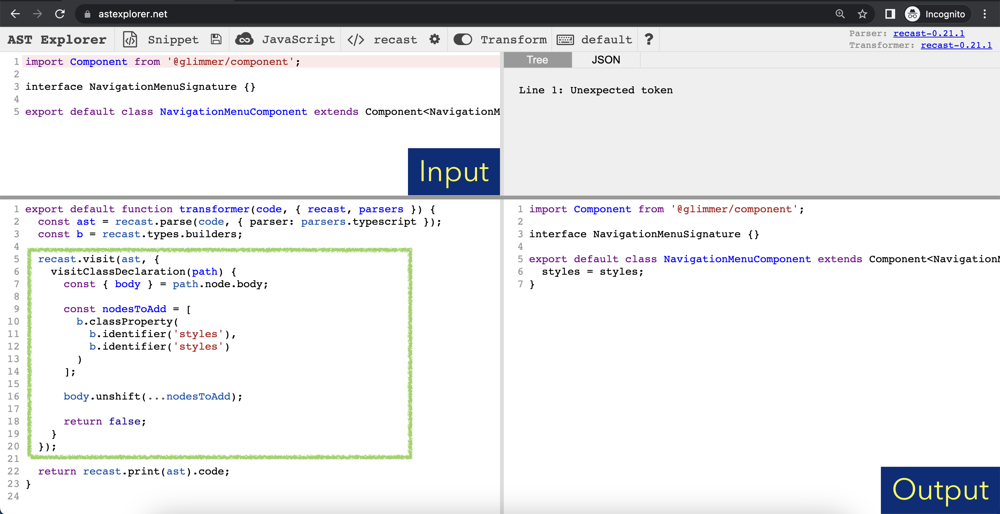

# @codemod-utils/ast-javascript

_Utilities for handling `*.{js,ts}` files as abstract syntax tree_


## What is it?

`@codemod-utils/ast-javascript` provides methods from [`recast`](https://github.com/benjamn/recast/) to help you parse and transform `*.{js,ts}` files.

::: code-group

```ts [How to update JavaScript]
import { AST } from '@codemod-utils/ast-javascript';

type Data = {
  isTypeScript: boolean;
};

function transform(file: string, data: Data): string {
  const traverse = AST.traverse(data.isTypeScript);

  const ast = traverse(file, {
    /* Use AST.builders to transform the tree */
  });

  return AST.print(ast);
}
```

:::


## API

### AST {#api-ast}

An object that provides `builders`, `print`, and `traverse`.

In a `traverse` call, you can specify how to visit the nodes of interest ("visit methods") and how to modify them ("builders").

- [Builders](https://github.com/benjamn/ast-types/blob/v0.16.1/src/gen/builders.ts#L3747-L4019)
- [Visit methods](https://github.com/benjamn/ast-types/blob/v0.16.1/src/gen/visitor.ts#L7-L307)


## How to test your code

Currently, `recast` lacks documentation and tutorials. This is unfortunate, given the large amount of builders and visit methods that it provides to help you transform code.

I recommend using [AST Explorer](https://astexplorer.net/) to test a small piece of code and familiarize with the API. The error messages from TypeScript, which you can find in your browser's console, can sometimes help.

If you intend to publish your codemod, I recommend using [`@codemod-utils/tests`](./codemod-utils-tests) (create and test file fixtures) to check the output and prevent regressions.


### AST Explorer {#how-to-test-your-code-ast-explorer}

Select the following options to create a 4-tab window:

- Language: `JavaScript`
- Parser: `recast`
- Transform: `recast`



Once you are satisfied with the code, you can copy-paste the visit method(s) to your file, then rename `b.` to `AST.builders.`.

::: code-group

```ts [Example (AST Explorer)]{6-19}
export default function transformer(code, { recast, parsers }) {
  const ast = recast.parse(code, { parser: parsers.typescript });
  const b = recast.types.builders;

  recast.visit(ast, {
    visitClassDeclaration(path) {
      const { body } = path.node.body;

      const nodesToAdd = [
        b.classProperty(
          b.identifier('styles'),
          b.identifier('styles')
        )
      ];

      body.unshift(...nodesToAdd);

      return false;
    }
  });

  return recast.print(ast).code;
}
```

```ts [Example (Your file)]{7-20}
import { AST } from '@codemod-utils/ast-javascript';

export function transform(file) {
  const traverse = AST.traverse(true);

  const ast = traverse(file, {
    visitClassDeclaration(path) {
      const { body } = path.node.body;

      const nodesToAdd = [
        AST.builders.classProperty(
          AST.builders.identifier('styles'),
          AST.builders.identifier('styles'),
        ),
      ];

      body.unshift(...nodesToAdd);

      return false;
    },
  });

  return AST.print(ast);
}
```

:::


## How to type your code

`@codemod-utils/ast-javascript` avoids re-exporting the types from `recast`. This is to prevent a change in their API from catastrophically affecting your code.

When you write a function that depends on their implementation, type what you don't own as `unknown`, then use `@ts-ignore` or `@ts-expect-error` as needed.

Most importantly, write tests to document the inputs and outputs of your codemod. When there is an API change, you can refactor code with ease and confidence.
