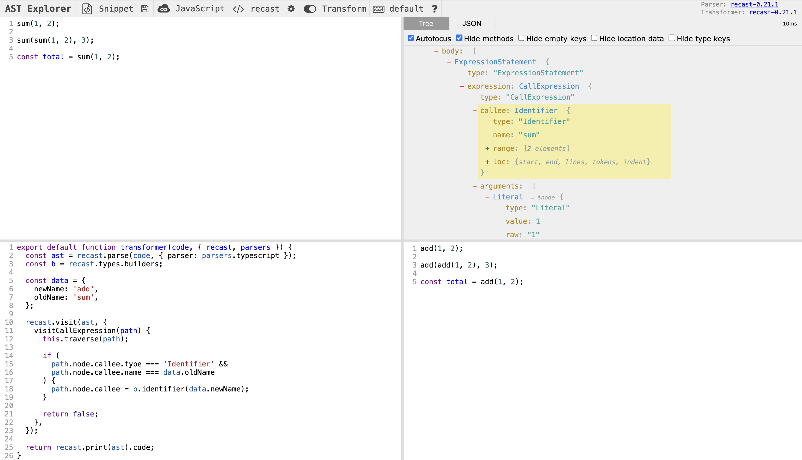

# @codemod-utils/ast-javascript

_Utilities for handling `*.{js,ts}` files as abstract syntax tree_


## What is it?

`@codemod-utils/ast-javascript` provides methods from [`recast`](https://github.com/benjamn/recast/) to help you parse and transform `*.{js,ts}` files.

::: code-group

```ts [How to update JavaScript]
import { AST } from '@codemod-utils/ast-javascript';

type Data = {
  isTypeScript: boolean;
};

function transform(file: string, data: Data): string {
  const traverse = AST.traverse(data.isTypeScript);

  const ast = traverse(file, {
    /* Use AST.builders to transform the tree */
  });

  return AST.print(ast);
}
```

:::


## API

### AST {#api-ast}

An object that provides `builders`, `print`, and `traverse`.

In a `traverse` call, you can specify how to visit the nodes of interest ("visit methods") and how to modify them ("builders").

- [Builders](https://github.com/benjamn/ast-types/blob/v0.16.1/src/gen/builders.ts#L3747-L4019)
- [Visit methods](https://github.com/benjamn/ast-types/blob/v0.16.1/src/gen/visitor.ts#L7-L307)

::: code-group

```ts [Example]{10,21,28}
import { AST } from '@codemod-utils/ast-javascript';

type Data = {
  isTypeScript: boolean;
  newName: string;
  oldName: string;
};

function transform(file: string, data: Data): string {
  const traverse = AST.traverse(data.isTypeScript);

  const ast = traverse(file, {
    visitCallExpression(path) {
      this.traverse(path);

      // Rename function
      if (
        path.node.callee.type === 'Identifier' &&
        path.node.callee.name === data.oldName
      ) {
        path.node.callee = AST.builders.identifier(data.newName);
      }

      return false;
    },
  });

  return AST.print(ast);
}
```

:::


## How to test your code

Currently, `recast` lacks documentation and tutorials. This is unfortunate, given the large amount of builders and visit methods that it provides to help you transform code.

I recommend using [AST Explorer](https://astexplorer.net/) to test a small piece of code and familiarize with the API. The error messages from TypeScript, which you can find in your browser's console, can sometimes help.

If you intend to publish your codemod, I recommend using [`@codemod-utils/tests`](./codemod-utils-tests) (create and test file fixtures) to check the output and prevent regressions.


### AST Explorer {#how-to-test-your-code-ast-explorer}

In the top navigation menu, select these options to create a 4-tab window:

- Language: `JavaScript`
- Parser: `recast`
- Transform: `recast`

The upper-left tab allows you to provide one or more examples of code. In the bottom-left tab, write the code that will transform the examples. You will see the results in the bottom-right tab.



Once you are happy with the code, copy-paste the visit method(s) to your file, then rename `b.` to `AST.builders.`.

::: code-group

```ts [Example (AST Explorer)]{11-22}
export default function transformer(code, { recast, parsers }) {
  const ast = recast.parse(code, { parser: parsers.typescript });
  const b = recast.types.builders;

  const data = {
    newName: 'add',
    oldName: 'sum',
  };

  recast.visit(ast, {
    visitCallExpression(path) {
      this.traverse(path);

      if (
        path.node.callee.type === 'Identifier' &&
        path.node.callee.name === data.oldName
      ) {
        path.node.callee = b.identifier(data.newName);
      }

      return false;
    },
  });

  return recast.print(ast).code;
}
```

```ts [Example (Your file)]{13-24}
import { AST } from '@codemod-utils/ast-javascript';

type Data = {
  isTypeScript: boolean;
  newName: string;
  oldName: string;
};

function transform(file: string, data: Data): string {
  const traverse = AST.traverse(data.isTypeScript);

  const ast = traverse(file, {
    visitCallExpression(path) {
      this.traverse(path);

      if (
        path.node.callee.type === 'Identifier' &&
        path.node.callee.name === data.oldName
      ) {
        path.node.callee = AST.builders.identifier(data.newName);
      }

      return false;
    },
  });

  return AST.print(ast);
}
```

:::


## How to type your code

In theory, every visit method provides you the correct type with `path`.

If a type error occurs when accessing a property in `path.node` or `path.value`, you likely didn't make an early exit correctly. If the error occurs because `recast` didn't provide enough information (e.g. `path.parent`, `path.parentPath`), then use `@ts-expect-error` to ignore the error for now.

If you need to refer to a specific type, you may use TypeScript's `typeof` operator and `Parameters` and `ReturnType` utilities to reach it.

```ts
import { AST } from '@codemod-utils/ast-javascript';

type Decorator = ReturnType<typeof AST.builders.decorator>;
```

Alternatively, you can type what you don't own as `unknown`, then use `@ts-expect-error` to ignore errors.
